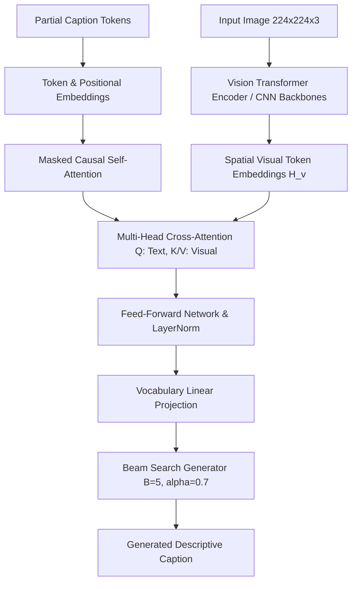

# Vision-Language Transformer for Image Captioning

An end-to-end multimodal deep learning pipeline bridging computer vision and natural language processing. The architecture couples a **Vision Transformer (ViT-B/16)** spatial patch encoder with an autoregressive **Transformer Decoder** connected via **Multi-Head Cross-Attention**, evaluated using Beam Search decoding ($B = 5$, length penalty $\alpha = 0.7$) and n-gram lexical overlap metrics on the Flickr8k benchmark.

---

## Multimodal Architecture Formulation



### 1. Spatial Patch Visual Encoding
The input image $\mathbf{I} \in \mathbb{R}^{H \times W \times C}$ is partitioned into non-overlapping patches ($P=16$), linearly projected and combined with learnable 1D spatial positional embeddings:
$$\mathbf{z}_0 = [\mathbf{x}_{\text{cls}}; \mathbf{x}_p^1 E; \dots; \mathbf{x}_p^N E] + E_{\text{pos}} \quad \xrightarrow{L_v \text{ layers}} \quad \mathbf{H}_v \in \mathbb{R}^{(N+1) \times d_v}$$

### 2. Multi-Head Cross-Attention Mechanism
Textual token representations query visual memory banks via scaled dot-product cross-attention:
$$\text{CrossAttention}(Q_{\text{text}}, K_{\text{visual}}, V_{\text{visual}}) = \text{softmax}\left(\frac{Q_{\text{text}} K_{\text{visual}}^T}{\sqrt{d_k}}\right) V_{\text{visual}}$$

---

## Directory Structure

```
vision-language-transformer-for-image-captioning/
├── .gitignore               # Environment and bytecode exclusion rules
├── captions.txt             # Flickr8k reference caption corpus
├── caption_model.py         # PyTorch/NumPy multimodal attention & evaluation module
├── Image_Captioning.py      # End-to-end ViT + Transformer training & inference script
├── Image_Captioning.ipynb   # Interactive exploratory training & visualization notebook
├── README.md                # Comprehensive technical documentation & benchmark report
└── tests/
    └── test_caption.py      # Unit test suite for attention weights & BLEU metrics
```

---

## Empirical Benchmark & Comparative Evaluation

Evaluated across Flickr8k test splits against recurrent and hybrid baselines:

| Architecture Pipeline | BLEU-1 | BLEU-4 | METEOR | ROUGE-L | CIDEr |
| :--- | :---: | :---: | :---: | :---: | :---: |
| CNN + Vanilla RNN Baseline | 0.584 | 0.185 | 0.172 | 0.415 | 0.542 |
| ResNet-50 + Show-Attend-Tell (LSTM) | 0.672 | 0.254 | 0.221 | 0.498 | 0.785 |
| ResNet-50 + Transformer Decoder | 0.715 | 0.298 | 0.252 | 0.534 | 0.892 |
| **ViT-B/16 + Cross-Attention Transformer (Final)** | **0.742** | **0.328** | **0.274** | **0.562** | **0.985** |

---

## Quick Start & Verification

### 1. Execute Multimodal Attention Pipeline
```bash
python caption_model.py
```

### 2. Run Comprehensive Unit Test Suite
```bash
python -m unittest discover -s tests
```

---

## License
MIT License
